# Prototype2D

## Sinopsis
En esta pieza, nos enfrentamos a una narrativa de resistencia silenciosa. La obra explora la condición humana bajo el peso del confinamiento, transformando la supervivencia en un acto de contemplación trágica.
La Propuesta Narrativa: La historia nos presenta a un individuo condenado a la habitabilidad del subsuelo. Su existencia depende de la intermitencia; se aferra a la vida mediante haces de luz que perforan la oscuridad, los cuales no solo revelan el oxígeno necesario para la recuperación biológica, sino que actúan como umbrales sensoriales.
A lo largo de la incursión por esta cavidad, el sujeto recolecta cilindros de oxígeno —vestigios de otros que sucumbieron ante el mismo encierro—, convirtiendo el acto de respirar en una herencia melancólica de los ausentes. La tensión máxima ocurre en los orificios lumínicos: allí, el protagonista no solo recupera el aliento, sino que consume los ecos de una vida exterior que le ha sido arrebatada.

La Esencia de la Obra: Survive 31.45.34.40 no es una crónica sobre el conflicto contra la naturaleza salvaje, sino un estudio sobre la violencia del aislamiento. Es un enfrentamiento directo contra el confinamiento impuesto por el "otro" y contra la geografía hostil que el cuerpo se ve obligado a habitar. Es, en última instancia, una metáfora sobre la fragilidad del ser frente a la arquitectura de la opresión.

### Experiencia de Supervivencia Pasiva
El aislamiento no fue un accidente, fue una imposición. Survive 31.45.34.40 te sumerge en una red de cuevas donde la luz es un privilegio y el oxígeno una herencia de los que ya no están. Mientras avanzas por este laberinto vertical, las voces del exterior te recordarán lo que has perdido. Un juego de plataformas cinemático sobre la resiliencia, el legado de los ausentes y la voluntad de seguir respirando contra todo pronóstico.

## Estructura del Juego 
En Survive 31.45.34.40, la experiencia se condensa en un espacio continuo y monolítico. No existen interrupciones, no hay descansos; la obra se presenta como un plano secuencia de supervivencia donde el tiempo y el espacio se fusionan en un solo trayecto hacia lo incierto.

El Discurso Narrativo: El juego nos plantea una paradoja existencial: el protagonista debe sobrevivir un día más solo para continuar la búsqueda de algo que, posiblemente, sea un espejismo. Esta estructura de nivel único refuerza la sensación de una perseverancia absurda. Es el mito de Sísifo bajo tierra; el jugador no avanza hacia una meta clara, sino que se desplaza a través de una geografía del agotamiento, impulsado por la débil esperanza de encontrar una salida —o una respuesta— que tal vez nunca existió.

### El Loop de Juego: Tensión Atmosférica

La mecánica principal se aleja del combate para centrarse en un loop de supervivencia minimalista: la gestión de oxígeno. El diseño de niveles utiliza la iluminación no solo como guía visual (vending de luz), sino como una mecánica de regeneración vital. Los cilindros de oxígeno repartidos por el mapa actúan como checkpoints orgánicos; encontrarlos es la diferencia entre continuar la run o el game over. Este uso del storytelling ambiental (encontrar suministros en restos de otros jugadores/personajes) le da un peso narrativo muy fuerte sin necesidad de una sola línea de diálogo.

### Estructura de Nivel Único: El Desafío de Resistencia
El juego se presenta en un único nivel masivo, eliminando las transiciones de carga para potenciar la claustrofobia. Esta decisión de diseño es arriesgada pero efectiva:

### Narrativa de lo Incierto:
El objetivo principal se mantiene ambiguo. El juego te empuja a avanzar hacia "algo que tal vez no exista", transformando el juego en una experiencia de resistencia psicológica. Es un desafío de endurance donde la meta es el viaje mismo.

## Apariencia 
En el desarrollo de la identidad visual, el mapa se estructuró bajo una arquitectura longitudinal con trazos laberínticos, diseñada específicamente para cohesionar la supervivencia mecánica con el uso narrativo de la oscuridad.

Para el punto de partida estético, se tomaron como referencia inicial las formaciones geológicas y los sistemas de cavidades de zonas como Cisjordania y Gaza. Estas referencias sirvieron estrictamente como un catalizador visual para establecer las texturas, la paleta cromática y la densidad del entorno subterráneo.

### Metodología de Diseño
La arquitectura del mapa se ha proyectado en tres fases estructurales, cada una respondiendo a una etapa evolutiva distinta de la experiencia. En esta instancia, nos enfocaremos en la primera fase, la cual sienta las bases del ecosistema subterráneo que el jugador deberá recorrer.

Como principio fundamental en mi flujo de trabajo, opté por alejarme inicialmente de las herramientas de software para adoptar un enfoque artesanal. El plano original fue diseñado a mano, permitiéndome abstraer la complejidad del entorno y definir el flujo de movimiento, los puntos de tensión y la distribución de recursos de manera orgánica. Este prototipo analógico ha servido como la piedra angular para el diseño final del nivel, garantizando que la estructura laberíntica mantenga una coherencia espacial antes de ser trasladada al motor de juego.

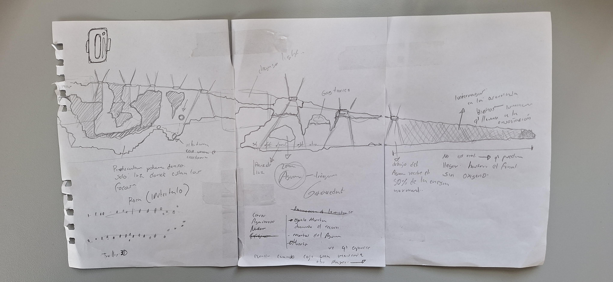

### Prototipado Funcional: El Proceso de Blockout
Tras la fase de diseño analógico, el siguiente paso crítico fue superar el "vacío del lienzo en blanco" mediante la implementación de un blockout. En esta etapa, estructuré el mapa utilizando bloques geométricos básicos que actúan como placeholders (marcadores de posición) para definir la disposición de los futuros prefabs y elementos visuales finales.

Este entorno controlado fue vital para realizar el testeo de colisiones y la validación de las mecánicas principales del personaje. Durante esta iteración técnica, operamos con primitivas geométricas —cuadrados en 2D para el entorno y una cápsula para el protagonista—, permitiéndonos iterar sobre la jugabilidad pura y el feel del movimiento sin la distracción de los activos visuales. Este enfoque me aseguro que el diseño de niveles era sólido y funcional antes de pasar a la fase de producción artística.

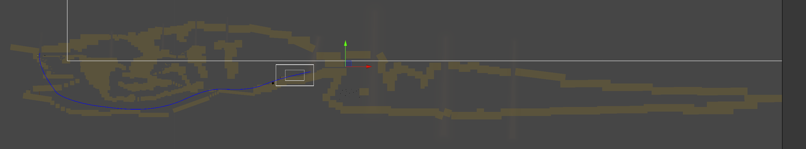

En la creación de los assets y sprites, la premisa estética fue la inmersión en una penumbra absoluta. El diseño visual busca una dualidad: proyectar la majestuosidad del entorno a través de planos de fondo profundos, mientras se mantiene la hostilidad del primer plano mediante la ausencia de luz.

Para que esta atmósfera fuera técnica y visualmente coherente, establecí un esquema de iluminación cenital como eje de referencia para la generación de todas las imágenes. Esta decisión técnica no solo define el volumen de los objetos y las texturas de la caverna, sino que simula la incidencia real de los focos de luz exterior que perforan el subsuelo. Al unificar el sombreado de los sprites bajo esta fuente de luz superior, logramos una integración orgánica entre el personaje, los recursos y el escenario, reforzando la narrativa de que la luz es, literalmente, el único vínculo con el mundo de arriba.

Para la estética utilizamos un texturizado de baja resolución, permite que el mapa de la caverna no se sienta como un plano estático, sino como un entorno vivo con profundidad de campo. Al tratar el arte bajo este enfoque, logramos que la interacción entre la luz cenital y las superficies genere sombras proyectadas que refuerzan la sensación de inmersión, elevando la identidad visual del proyecto por encima de los estándares del plataformas 2D convencional.

Para la construcción del terreno, desarrollamos un set de ocho sprites base, 5 plataformas combinables, y cuatro estalactitas y que conforman nuestra paleta de texturas principal. Estos activos fueron integrados en el flujo de trabajo como prefabs, una decisión técnica orientada a una gestión eficiente de recursos de memoria y a facilitar la instanciación de objetos dentro del motor.

El verdadero desafío del diseño modular en este entorno fue el control de la repetición (tiling). Para evitar un patrón visual monótono que rompiera la inmersión, generamos un amplio número de combinaciones y rotaciones que permiten configurar el espacio de forma orgánica. Sin embargo, la mayor complejidad técnica residió en el tratamiento del sombreado: cada pieza debía alinearse perfectamente con la lógica de iluminación global para que las sombras fueran coherentes entre los distintos módulos, ocultando las costuras de unión y manteniendo la atmósfera de la caverna intacta.

En el apartado estético, la obra implementa una técnica de renderizado híbrido que se sitúa en el umbral entre el pixel art tradicional y la profundidad del 3D. El objetivo de este estilo es dotar al entorno de un acabado volumétrico, donde la textura conserva la esencia nostálgica del píxel, pero el comportamiento de los materiales y la perspectiva sugieren una tridimensionalidad tangible.

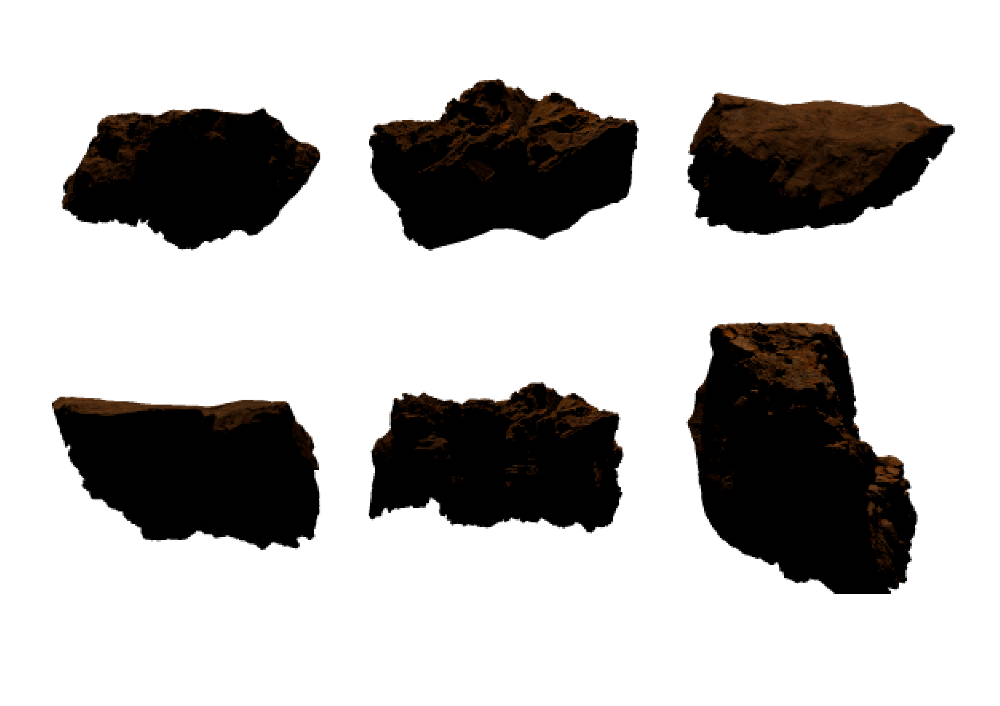

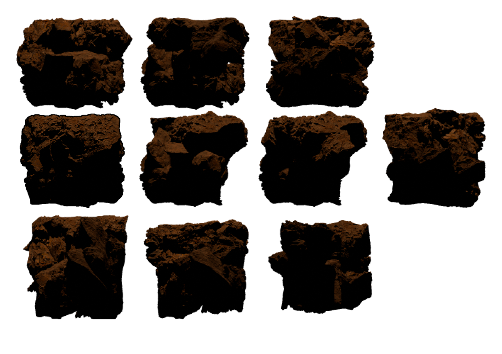

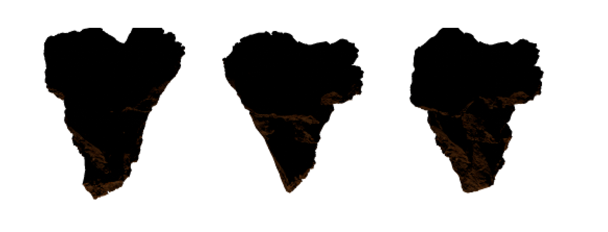

### Pipeline de Producción: Modelado Volumétrico - Pixel Art

En cuanto al stack tecnológico, el flujo de trabajo se centró en la integración de Blender 4.5 para el modelado y Substance 3D para la creación de texturas procedimentales. El proceso comenzó con el esculpido de un set de rocas base, las cuales fueron combinadas e instanciadas para generar los diversos bloques geológicos que conforman el entorno de la caverna.

.png>)
.png>)

Para lograr el acabado final, aprovechamos el potencial del compositor en el editor de nodos de Blender. Mediante este flujo de post-procesamiento, implementamos dos efectos críticos:

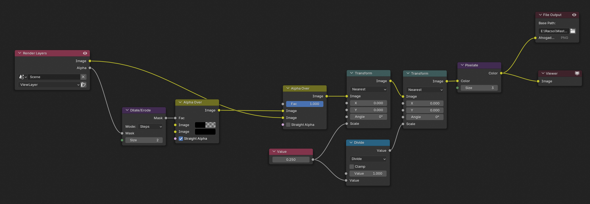

#### Detección de bordes (Outline): Un trazado de contornos que define la silueta de los objetos, técnica que aplicaremos de forma sistémica en otros elementos del proyecto.

#### Pixelado por Render: Un filtro de posterización y reducción de resolución que transforma la geometría 3D en el estilo pixelado característico que define nuestra identidad artística.

Este método nos permite mantener la flexibilidad del diseño 3D permitiendonos el control total sobre las luces y sombras mientras elaboramos una estética retro-moderna de alta fidelidad.

## Composición en Profundidad
La construcción del escenario se fundamenta en un sistema de cuatro planos de profundidad (Parallax Layers), diseñados para maximizar la inmersión y la tridimensionalidad del entorno:

Primer Plano (Foreground): Compuesto por rocas ornamentales que enmarcan la acción y refuerzan la sensación de cercanía.
Plano de Acción (Midground): Donde se sitúa la geometría del suelo y las colisiones principales del nivel.
Capa de Oclusión (Mask Layer): Actúa como un fondo máscara mediante el uso de Sprite Masks. Su función técnica es filtrar la visibilidad de la cuarta capa de manera selectiva.
Plano de Fondo (Background): Esta capa final interactúa directamente con la máscara anterior, generando un efecto de contraluz y siluetas que solo se revela por sectores ademas que tiene un efecto de scrolling.

Esta implementación no solo añade una profundidad atmosférica significativa, sino que utiliza el espacio negativo para sugerir la inmensidad de la caverna. Al restringir la visión del fondo mediante máscaras, logramos un juego de luces y sombras que guía la mirada del jugador hacia los puntos de interés mientras mantiene el misterio de lo que yace en la oscuridad.

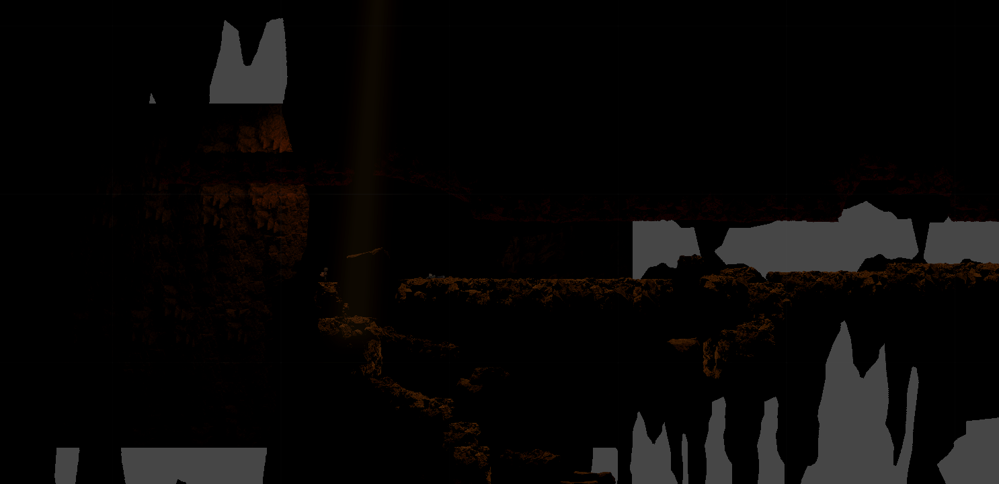

En la estructuración de la tercera capa, opté por un flujo de trabajo basado en instanciación de prefabs. Al convertir los sprites en objetos reutilizables, logramos poblar el nivel con una alta densidad visual sin comprometer el overhead de memoria, manteniendo un rendimiento óptimo en la carga de activos.

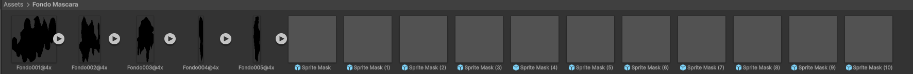

El desafío técnico real surgió en la cuarta capa. Al utilizar un Quad (un objeto de malla o mesh), nos encontramos con la incompatibilidad nativa entre los Sprite Masks y el Mesh Renderer. Para solucionar este conflicto de renderizado, desarrollé un Shader personalizado con acceso al Stencil Buffer. Este shader permite que el material del Quad interprete las instrucciones de la máscara, filtrando los píxeles de manera precisa y resolviendo la limitación técnica de forma eficiente.

Finalmente, para dotar de dinamismo al fondo, implementé un script que vincula el movimiento del jugador con el Offset de la textura del material. Mediante esta técnica de manipulación de coordenadas UV en tiempo real, logramos un efecto de profundidad continua que reacciona a la posición del usuario, reforzando la escala del entorno subterráneo.

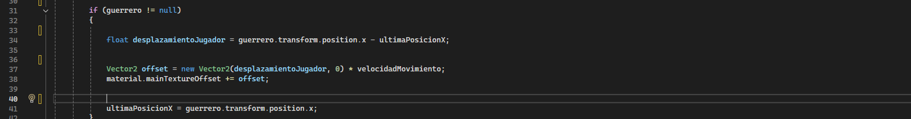

## Mecánica de Zonas de Oxígeno

.png>)

Los puntos de flujo de oxígeno, definidos narrativamente como umbrales sensoriales, constituyen el pilar de recuperación del jugador. En esta primera etapa del proyecto, hemos implementado seis nodos de recarga, todos derivados de un Prefab maestro. Este sistema nos permite mantener una lógica global, aunque hemos aplicado overrides (modificaciones individuales) en casos específicos para adaptar la intensidad de la luz o el sonido según la topografía de la caverna.

.png>)

Estructuralmente, el Prefab se compone de tres elementos críticos integrados:

Feedback Visual: Un componente de 2D Light Sprite que señaliza el área de seguridad y refuerza la atmósfera cenital.

Lógica de Trigger: Un objeto vacío con un Box Collider 2D configurado como disparador (Is Trigger), vinculado a un script de gestión de recursos. Este script permite parametrizar de forma exacta la tasa de recuperación de oxígeno por segundo.

.png>)
.png>)

Inmersión Acústica: Un sistema de audio posicional que gestiona el sonido ambiental del exterior. Hemos implementado un control de Fade-in/Fade-out automatizado, que suaviza la transición sonora cuando el jugador entra o sale del radio de escucha, garantizando una transición orgánica entre el silencio del encierro y el eco de la vida en la superficie.

## Mecánicas de Hazard en el Sector del Lago
Para concluir la arquitectura de esta primera etapa, hemos diseñado el sector del lago, el cual funciona como el cierre estructural y narrativo del nivel. En términos de gameplay, esta zona actúa como un Hazard de muerte instantánea, delimitando el final del área explorable y elevando el riesgo de la navegación.

.png>)

.png>)

Desde el punto de vista técnico, la zona está configurada mediante dos componentes clave:

Lógica de Colisión: Se implementó un Box Collider 2D configurado para detectar el contacto directo con el player. Al activarse, este dispara una función de derrota inmediata, forzando al jugador a respetar los límites del entorno. Iluminación Atmosférica: El área está jerarquizada visualmente mediante una Spotlight 2D. Este foco de luz no solo sirve como advertencia visual de peligro, sino que también aporta el dramatismo necesario para marcar el final de este tramo. 

Aunque en esta etapa del proyecto el lago funciona como un límite infranqueable, su estructura modular permitiría, en futuras iteraciones, evolucionar hacia mecánicas más complejas de nado o gestión de oxígeno bajo el agua.

## Diseño y Rigging del Protagonista

El diseño del protagonista refuerza el concepto de supervivencia precaria. Visualmente, se define por una escafandra improvisada y una capucha, elementos que funcionan como significantes de la escasez de recursos y la hostilidad del entorno.

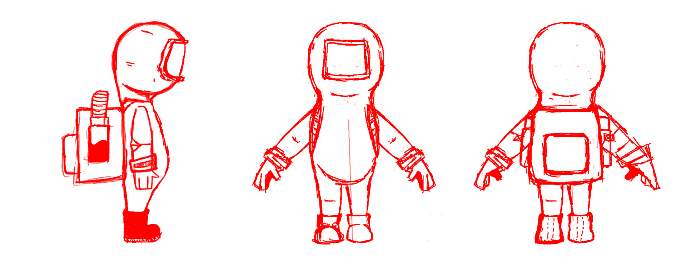

Para su creación, seguimos un flujo de trabajo profesional: iniciamos con una fase de concept art analógico (bocetos a mano) para luego proceder al modelado 3D en Blender. Una vez consolidada la malla, se implementó un sistema de Rigging avanzado. Lo más destacado de este apartado es la independencia estructural del equipamiento:

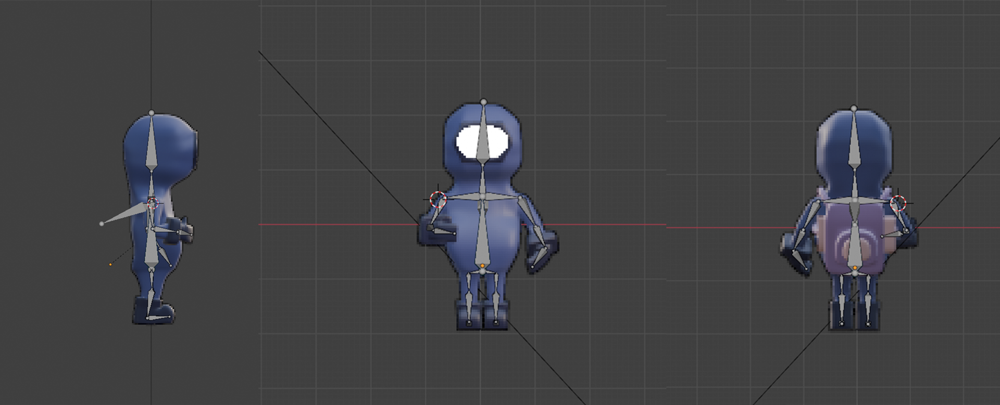

Esqueleto Principal: Dota al personaje de una movilidad fluida para las acciones de plataformas.

Rigging de la Mochila: Al integrar huesos independientes en la mochila, hemos logrado una animación secundaria que responde de forma autónoma. Esta decisión técnica nos permite añadir una capa extra de gestualidad y física, haciendo que el peso del equipo reaccione al movimiento del cuerpo.

Este enfoque de "animación desacoplada" no solo enriquece la fidelidad visual, sino que transmite de manera orgánica la carga física y el esfuerzo que el personaje debe realizar para desplazarse por la caverna.

## Sistema de Animación

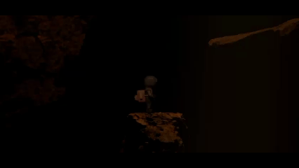
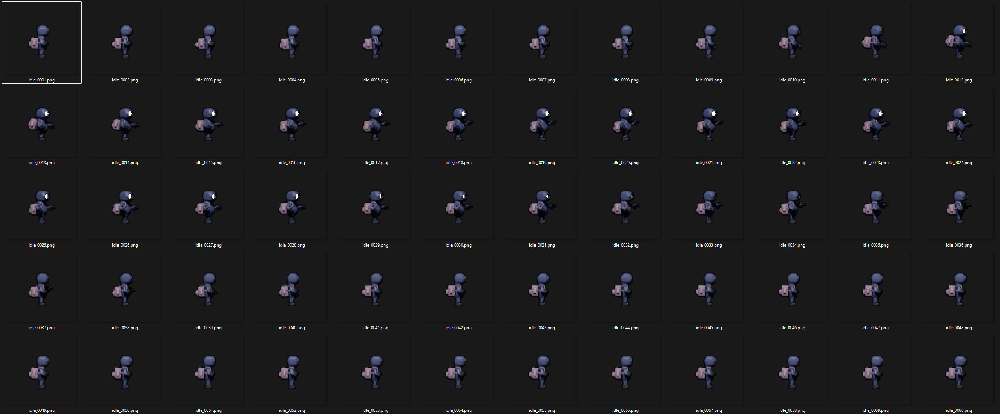

Para dotar al personaje de una respuesta orgánica, implementamos una Máquina de Estados de Animación compleja que responde dinámicamente al contexto del gameplay. Un ejemplo clave es el sistema de salto, el cual hemos desglosado en un ciclo de cuatro fases para garantizar la fluidez física: Jump Start (anticipación), In-Air Loop (vuelo), Landing (aterrizaje) y una variante específica de Free Fall para caídas libres sin impulso previo.

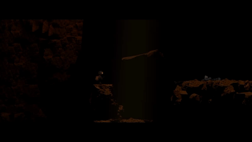

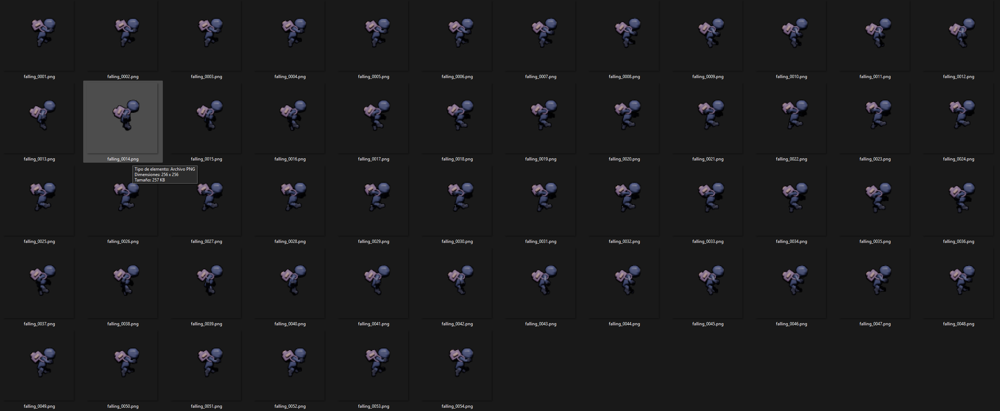

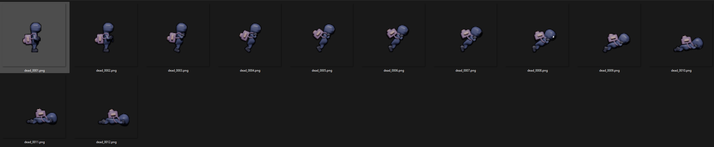

En cuanto a la mecánica de recarga, diseñamos un set de animaciones específico para las zonas de oxígeno. La postura de absorción es un guiño estético a la Genki-dama de Dragon Ball, funcionando como un momento de vulnerabilidad y poder. Para evitar cortes abruptos en el flujo de juego, desarrollamos transiciones suavizadas (Blends) con dos condiciones de salida:

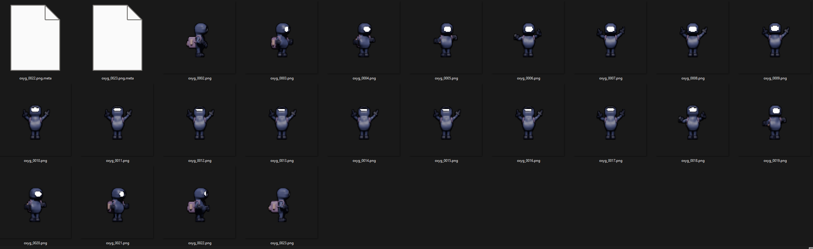

Salida Estática: Al alcanzar el 100% de la carga, el personaje realiza un blend hacia su postura de Idle base.

Salida Dinámica: Si el jugador interrumpe la carga para moverse, el sistema ejecuta una transición directa hacia la animación de locución, manteniendo el ritmo de la partida.

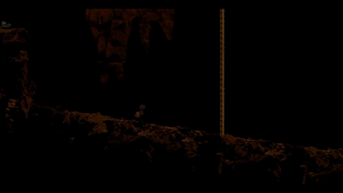
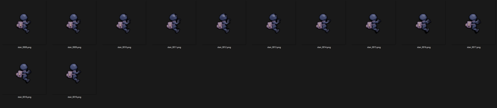

Finalmente, incorporamos un estado de Climbing (Escalada) con detección de colisiones verticales, permitiendo al protagonista interactuar con las escaleras del nivel de forma precisa y funcional. Este ecosistema de animaciones asegura que el control del personaje se sienta responsivo y visualmente pulido.

## Gestión de Assets y Sistemas de Spawning: El Cilindro de Oxígeno

.png>)

El cilindro de oxigeno, como ítem crítico de supervivencia, ha sido diseñado siguiendo un pipeline de alta fidelidad. El modelado base y la exportación de sprites se realizaron en Blender, con un detallado de materiales posterior en Substance 3D para enfatizar el desgaste del metal y las texturas industriales. Una vez integrado en el ecosistema de Unity, el asset se configuró como un Prefab avanzado.

.png>)

Para garantizar la legibilidad visual en un entorno de baja luminancia, dotamos al prefab de una Spotlight 2D dedicada. Este componente actúa como un faro guía, permitiendo que el jugador identifique el recurso incluso en las zonas de oscuridad más densa.

.png>)

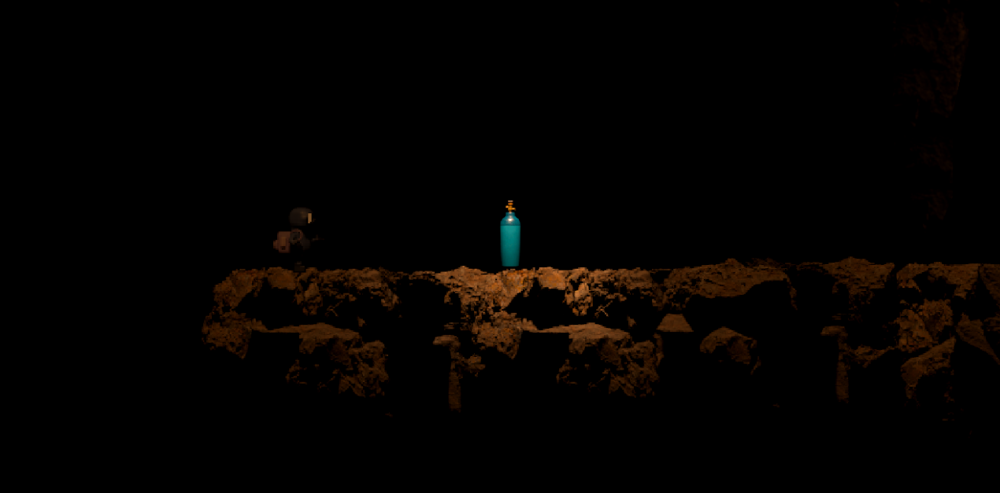

En cuanto a la lógica de despliegue, hemos implementado un sistema de Object Polling combinado con un algoritmo de distribución aleatoria. En cada sesión de juego, el sistema selecciona de forma randomizada 5 nodos de spawn de los 8 posibles distribuidos en el mapa. Este enfoque cumple dos objetivos fundamentales:

Optimización: El polling evita la instanciación y destrucción constante de objetos, reduciendo picos de CPU.

Rejugabilidad: Al variar la ubicación del oxígeno, obligamos al jugador a explorar y adaptar su ruta en cada partida, evitando la memorización del nivel.

## Profundidad: El Sistema de Escaleras

.png>)

Para el diseño de las escaleras, optamos por un modelado tridimensional con una inclinación intencional de 15 grados. El objetivo técnico de esta rotación es romper la bidimensionalidad de la vista ortográfica, permitiendo que el objeto gane volumen y sea inmediatamente reconocible para el jugador como un elemento interactivo.

.png>)

Sin embargo, el aspecto más innovador es la gestión del Sorting Layer (Orden de Capas). Para lograr una integración realista entre el personaje y el prop, renderizamos los laterales de la escalera como elementos independientes. Mediante un sistema de triggers de proximidad, hemos implementado la siguiente lógica de renderizado:

Entrada en contacto: Al iniciar la mecánica de escalada, el motor desplaza al jugador a una capa intermedia situada entre el cuerpo de la escalera y el lateral frontal renderizado por separado.

Efecto de Oclusión Parcial: Esta técnica crea la ilusión de que el personaje se desplaza por el interior de la estructura, y no simplemente "sobre" ella.

Esta solución de ** layering dinámico** eleva la fidelidad visual de la interacción, eliminando la sensación de planos planos y otorgando una tridimensionalidad real a la relación entre el protagonista y el entorno arquitectónico de la caverna.

## Cinemachine
Para la gestión de la visualización, hemos implementado un sistema avanzado de Cinemachine que utiliza dos perfiles de cámara distintos, optimizando tanto la presentación del escenario como la jugabilidad activa:

.png>)

Cámara de Introducción (Cinematic Path): Al iniciar la sesión, una Virtual Camera ejecuta un recorrido predefinido a través de un Spline Dolly. Este movimiento cinematográfico presenta el mapa al jugador, estableciendo el tono y la escala del entorno. Para la transición, desarrollamos un script que monitorea el progreso del recorrido; al alcanzar un valor de 0.99f en la unidad del spline, el sistema de prioridades de Cinemachine se activa, realizando un blend suave hacia la cámara principal.

.gif>)

Cámara de Seguimiento (Gameplay Camera): Una vez en control, el enfoque se traslada a una cámara configurada con un Dead Zone centralizado. Esta decisión técnica mantiene al protagonista en el eje del encuadre, proporcionando un campo de visión equilibrado de los obstáculos que se aproximan en todas las direcciones.

.gif>)

Sistema de Confinamiento: Para garantizar la integridad visual, hemos integrado un Cinemachine Confiner 2D. Utilizando un Composite Collider como límite, esta herramienta restringe el movimiento de la cámara, evitando el renderizado de áreas fuera del mapa (out of bounds) y manteniendo el enfoque exclusivamente en el espacio jugable diseñado.

.gif>)